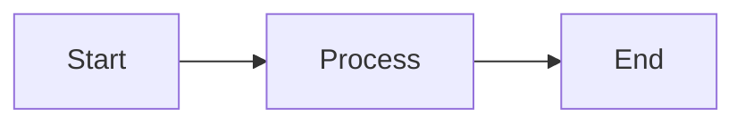

# Your Article Title

Write your article content here using Markdown.

## Subheading

You can use all standard Markdown features:

- Lists
- **Bold** and *italic* text
- [Links](https://example.com)
- Code blocks

```javascript
// Code with syntax highlighting
function example() {
  return "hello world";
}
```

## Mermaid Diagrams

You can also include Mermaid diagrams:



## Conclusion

Wrap up your thoughts here.
