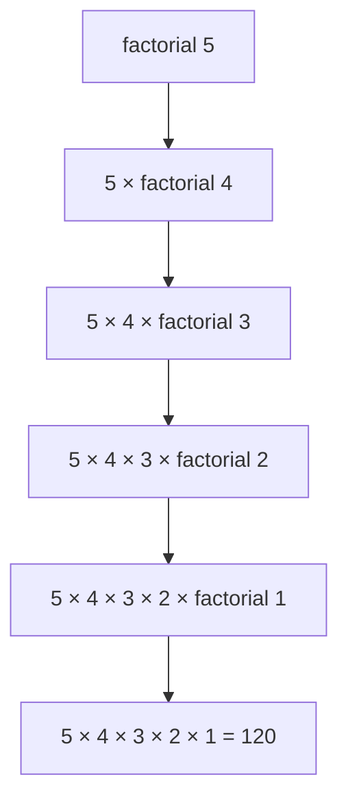

# Understanding Recursive Algorithms

Recursion is one of the fundamental concepts in computer science. At its core, a recursive function is one that calls itself with modified parameters until it reaches a base case.

## The Anatomy of Recursion

Every recursive function needs two key components:

1. **Base case**: The condition that stops the recursion
2. **Recursive case**: The function calling itself with modified parameters

Here's a classic example—calculating factorial:

```javascript
function factorial(n) {
  // Base case
  if (n <= 1) return 1;

  // Recursive case
  return n * factorial(n - 1);
}
```

## Visualizing the Call Stack

When you call `factorial(5)`, here's what happens:



## When to Use Recursion

Recursion is particularly useful for:

- Tree and graph traversal
- Divide and conquer algorithms
- Problems with natural recursive structure (e.g., Fibonacci, Tower of Hanoi)
- Backtracking problems

## Tail Call Optimization

Some languages optimize tail-recursive functions to prevent stack overflow:

```javascript
function factorialTail(n, acc = 1) {
  if (n <= 1) return acc;
  return factorialTail(n - 1, n * acc);
}
```

In this version, the recursive call is the last operation, allowing the compiler to optimize it into a loop.

## Conclusion

While recursion is elegant and can simplify complex problems, it's not always the most efficient solution. Consider iterative approaches when stack depth becomes a concern or when performance is critical.
