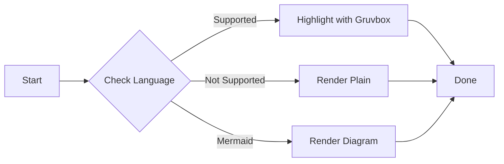

# Gruvbox Syntax Highlighting

This article tests our custom syntax highlighting implementation using highlight.js with gruvbox colors.

## JavaScript

```javascript
function fibonacci(n) {
  if (n <= 1) return n;
  return fibonacci(n - 1) + fibonacci(n - 2);
}

const result = fibonacci(10);
console.log(`Fibonacci(10) = ${result}`);
```

## TypeScript

```typescript
interface User {
  id: number;
  name: string;
  email: string;
}

async function fetchUser(id: number): Promise<User> {
  const response = await fetch(`/api/users/${id}`);
  return response.json();
}
```

## Python

```python
from dataclasses import dataclass
from typing import List

@dataclass
class Article:
    title: str
    author: str
    tags: List[str]

    def __str__(self) -> str:
        return f"{self.title} by {self.author}"

# Create an instance
article = Article("Test", "Author", ["tag1", "tag2"])
print(article)
```

## Rust

```rust
fn factorial(n: u64) -> u64 {
    match n {
        0 | 1 => 1,
        _ => n * factorial(n - 1),
    }
}

fn main() {
    println!("5! = {}", factorial(5));
}
```

## Code without language (no highlighting)

```
This is plain text
It should not be highlighted
Just rendered as-is
```

## Inline Code

You can also use inline code like `const x = 42;` or `let y = "hello";` within text.

## Mermaid Diagram



Everything should work perfectly now with gruvbox colors!
