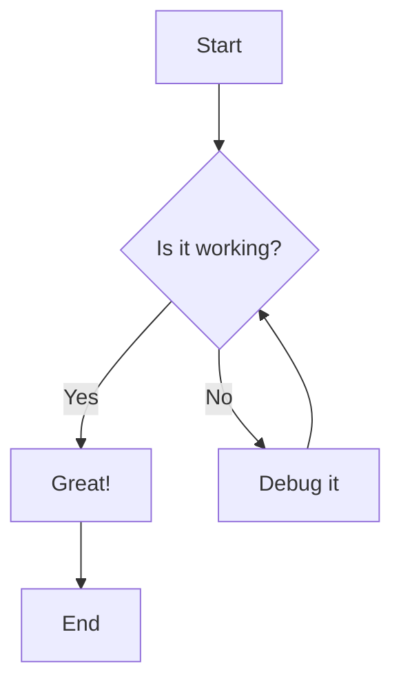
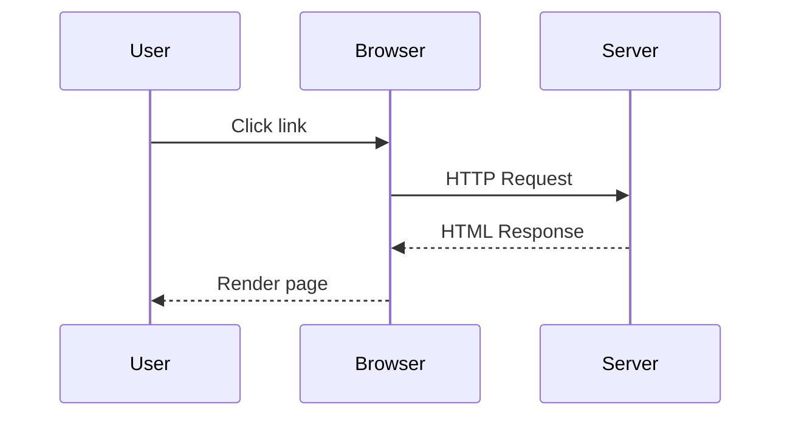

# Mermaid and Code Together

This tests that both features work side by side.

## A Simple Flowchart



## Some JavaScript Code

```javascript
function checkDiagram(isWorking) {
  if (isWorking) {
    console.log('Great!');
  } else {
    console.log('Debug it');
  }
}
```

## A Sequence Diagram



## More Code

```typescript
interface Diagram {
  type: 'flowchart' | 'sequence' | 'class';
  content: string;
}

function renderDiagram(diagram: Diagram): void {
  console.log(`Rendering ${diagram.type} diagram`);
}
```

Both should work perfectly now!
